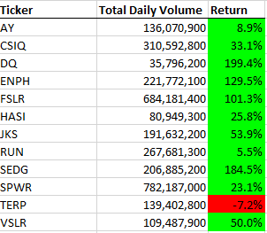
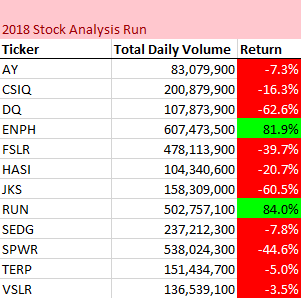
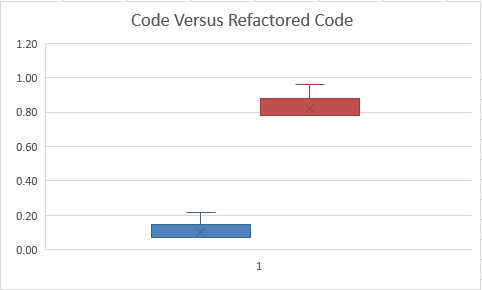

# VBA_Challenge

## Overview of Project

### Purpose 
Steve is a financial advisor for his parents and in his research of twelve stocks has sought the analytical expertise to get a summary of daily volume and returns across all the ticker symbols for the stocks. While he is satisfied with the analysis, he anticipates needing to have robust tool that has capability to handle larger data set without compromising on the time to complete the analysis. 

The main objective of refactoring is to achieve optimization so that going forward when Steve has multiple functions to perform research on entire stock data the code does not take too long to execute. 
 Refactoring of the code has been done mainly to make the code more readable and efficient with improved execution time. The code has been revised only in terms of the structure and for specific sections with intention to improve the implementation time and not alter the code’s external behavior and functionality. 

### Background

Steve wanted analysis to be performed on 12 stocks to begin with, so that he could advise his parents to make an informed investment decision. The analysis that was provided to Steve has been helpful for him for the given data set. The analysis involved providing a summary of all stocks for their ticker symbol, total daily volume and returns. Steve’s parents initially had an inclination to go with DQ stock and based on the analysis that was performed it does not appear to be a good choice. The data set has not changed however, in anticipation of need to research additional stock data, the code has been revisited and modified. 
 
## Results

### Methodology
In the refactored code, the tickers are organized into ticker Index. In both original and refactored code the base code looked at the array of tickers and hence they are numbered from zero to 11. The code is written such once the ticker index is created, output arrays are declared, and ticker volume is initialized to zero, then the ticker volume is increased based on the cell reference for each ticker index. 
Both original and refactored code look for first row of ticker index and last row for that ticker index to get the ticker start and end price. However, in the refactored code the ticker index is also incremented by 1. In the refactored code by working at ticker index level, the way the code runs and scans the data to fetch output values is more efficient as does not loop through same data over and over.

### Findings
The data that is provided for the stocks is for two consecutive years: Year 2017 and Year 2018. 

The executive time in seconds on average is much lower for the refactored code and the graph below depicts few values that are compared for 5 runs of stock data analysis with original code and refactored code. 

On average the execution time for the code was 0.82 secs for 2017 and 0.83 secs for 2018 stock analysis and this was reduced to 0.10 secs and 0.09 secs respectively with the refactored code. 

## Summary

Refactoring of the code is powerful and disciplined technique for restructuring an existing body of code, altering its internal structure without changing its external behavior. 

### General Advantage on refactored code
1. Chances of Enhancement are high- For new functionalities this can be beneficial to have the code well written
2. Code Smell is Detected- Sometimes bad patterns like duplicate code, long methods are detected in the code
3. Bug Fixing- Having it looked through and refactored will potentially not introduce bugs if code is well written. 
4. Peer Review- Peer review is an important part of code refactoring. Having relooked at the code this code has been peer reviewed.

### Potential pitfalls

1. Stable code need not be refactored – if intention is to not use the code for additional functional or additional data sets, there is no need to refactor code. Do not fix what is not broken. 

2. Delivery deadline is impacted by refactoring- refactoring and testing code takes time and in general this should be thought through before continuing to refactor the code as a practice. 

3. Cost benefit analysis- If cost of refactoring is higher, sometimes writing code from scratch works better. 

### Application 

In this scenario refactoring is beneficial in terms of execution time to run the code. Also if the stock data increases in complexity and volume, the time taken to execute the code is clearly advantageous for larger data sets. Other than run time efficiency, the code is also slightly easier with the way ticker index is added while the data gets scanned. 
However, if the tickers were not organized in an order and if the tickers repeated across rows in disorderly manner, this could cause issues to applying this exact same code. Prerequisites in general is to understand the data, sort it and have it organized as needed to prevent code failures. As additional needs arise to analyze data to achieve specific output, refactoring may or may not always be a desired solution. 
